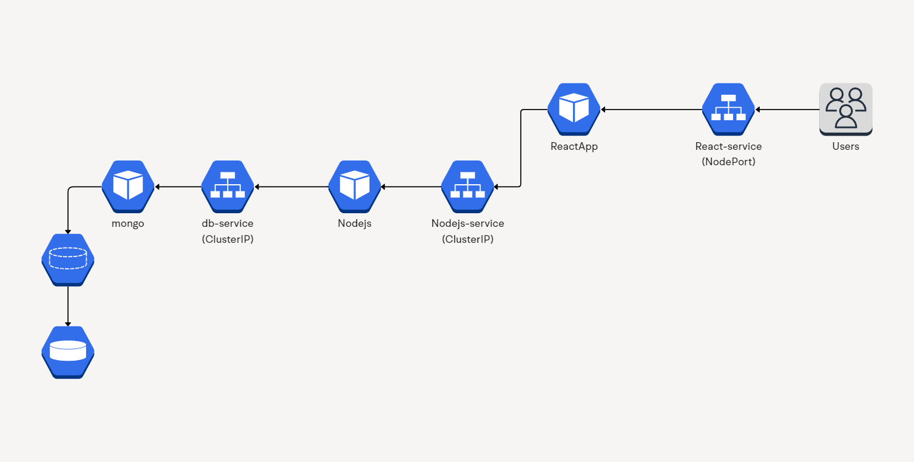

# Media Sharing Application - Kubernetes Cluster Setup

This repository contains instructions for deploying a media sharing application in a Kubernetes (k8s) cluster. The application is structured using Kubernetes resources such as Deployments, Services, PersistentVolumes (PVs), PersistentVolumeClaims (PVCs), and ConfigMaps. Here's an overview of each component and its role within the application:

## Components

### Database Deployment (`db-deployment`)

- Manages MongoDB for storing media and metadata.
- Ensures data persistence and availability using PersistentVolumes (PVs) and PersistentVolumeClaims (PVCs).

### React Application Deployment (`react-app`)

- Frontend built with React.
- Configured via `react-app-config` ConfigMap to specify environment-specific variables like API URLs.
- Accessible externally through a NodePort Service (`react-service`).

### Services

- **db-service**:
  - Provides internal cluster communication for the MongoDB database.
  
- **react-service**:
  - Exposes the React frontend to external users via NodePort (`react-service`).
  
- **nodejs-service**:
  - Backend service supporting media uploads, metadata storage, and retrieval.
  - Exposed via NodePort (`nodejs-service`).

## Usage

Follow these steps to deploy the media sharing application in your Kubernetes cluster:

1. **Configure ConfigMap**:
   - Define `react-app-config` to set API URLs and other configurations.

2. **Deploy Components**:
   - Apply YAML manifests for `db-deployment`, `react-app`, and `nodejs-deployment`.

3. **PersistentVolumes (PVs) and PersistentVolumeClaims (PVCs)**:
   - Ensure PV and PVC configurations are set up for MongoDB data persistence.

4. **Services**:
   - Expose `react-service` and `nodejs-service` using NodePort for external accessibility.

5. **Access the Application**:
   - Access the React frontend via the NodePort Service endpoint.
   - Interact with the media sharing application to manage media content.

## Monitoring and Management

- Monitor application health and performance
